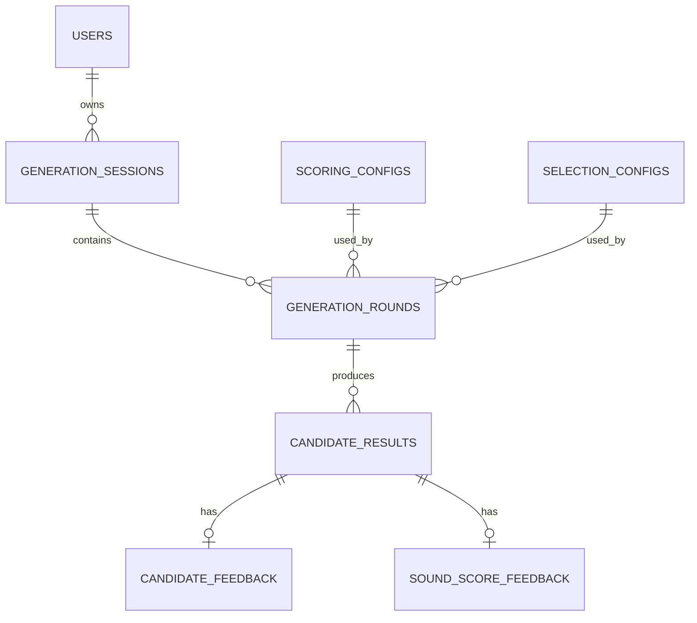

# Persistence / Database 詳細設計 v0.1

更新日: 2026-08-12

## 1. 位置づけ

本書は `docs/system-design-v0.1.md` を補足し、M6 - Persistence / SQLite + Drizzle の詳細設計を定義する。

M6の目的は、M0〜M5で確立したDomainロジックの出力を、後から復元・比較・分析できる形でSQLiteへ永続化することである。

v0.1のDBは「後から修正された正解データ」を保存する場所ではない。

その時点の、

- Candidate Generation結果
- Reading / Rhyme表現
- Sound Score
- Semantic Evaluation
- Candidate Selection
- User Feedback
- 使用したconfig / version / model / prompt

を、**当時の実験結果として保存する**。

後に評価基準が変わり、過去のscoreやselectionが誤っていたと判明しても、元のsnapshotを上書きしない。

---

## 2. M6の責務境界

M6で実装する。

- SQLite database connection
- Drizzle schema
- migration files / migration workflow
- Persistence用mapper
- Round / Candidate snapshot保存
- immutable config保存
- Candidate Feedback保存
- Sound Score Feedback保存
- Persistence integration test
- transactionによるatomic persistence

M6では以下を実装しない。

- Candidate Generation pipelineのApplication orchestration
- real LLM接続
- API
- UI
- PreferenceProfile
- Preference学習
- Feedback変更履歴
- Candidate rescore履歴
- Selection reevaluation履歴
- LLM call log
- failed pipeline / operation log
- token usage / cost log
- performance timing log
- DB自動backup機能
- user authentication

これらは必要性が発生したMilestoneで追加する。

---

## 3. Persistence設計原則

### 3.1 Experiment snapshot

以下は原則immutableな実験snapshotとして扱う。

- GenerationSession
- GenerationRound
- CandidateResult
- ScoringConfig
- SelectionConfig

一度保存したSound Score、Semantic Score、selected状態等は、新しい評価方式ができても上書きしない。

将来再評価結果を保存する必要が生じた場合は、元データを変更せず別entityを追加する。

概念例:

```text
CandidateRescore
SelectionReevaluation
```

これらはv0.1 / M6では実装しない。

### 3.2 Feedback is current state

以下は履歴ではなく現在値として扱う。

- CandidateFeedback
- SoundScoreFeedback

Like -> Dislike等の変更があった場合、同じrowをupdateする。

### 3.3 Raw snapshot + analytical projection

外部AdapterやDomain resultの完全なsnapshotをJSONで保存する。

同時に、β分析で頻繁に使用する値は個別columnへprojectionする。

```text
JSON snapshot
= 当時のresult全体を復元するための一次記録

scalar columns
= SQLで検索・集計しやすくするためのprojection
```

多少の重複より、再現性と分析可能性を優先する。

---

## 4. Runtime / Database technology

### 4.1 SQLite runtime

v0.1ではNode.js組み込みの `node:sqlite` を使用する方針とする。

```text
Next.js / Node.js
      ↓
node:sqlite
      ↓
Drizzle ORM
      ↓
SQLite database file
```

`node:sqlite` はNode.jsに含まれるため、OSへSQLite本体を別途インストールすることをM6の前提にしない。

SQLite CLIは手動調査には利用可能だが、開発・実行の必須要件としない。

### 4.2 Drizzle

Drizzle ORMをPersistenceのtyped SQL / schema layerとして使用する。

Drizzle schemaはInfrastructureの実装詳細であり、DomainからDrizzleへ依存してはならない。

想定配置:

```text
src/
└─ infrastructure/
   └─ persistence/
      ├─ schema.ts
      ├─ database.ts
      ├─ mappers/
      └─ repositories/
```

### 4.3 Version compatibility gate

M6実装開始時に、Node 24.19.0と選択するDrizzle ORM / Drizzle Kitの互換性を確認してversionをpinする。

2026-08-12時点の公式Drizzle資料では `node:sqlite` 自体はdocumentされている一方、現行Node:SQLite guideはv1 RC系packageを例示している。またDrizzle Kitでの `node:sqlite` migration / Studio supportはv1 beta系で追加された履歴がある。

したがってM6では以下を守る。

- design段階でRC dependencyを無条件に固定しない
- M6実装時にcompatible version setを確認してpinする
- 安定版のみで必要workflowを満たせない場合、CodexはRCへ独自移行せず停止して報告する
- ORM / migration toolのmajorまたはpre-release採用は明示的に受入確認する

Product / Domain仕様をDrizzleのversion事情へ依存させない。

---

## 5. Data lifecycle

### 5.1 Initial generation

概念上の処理:

```text
User
↓
source word入力
↓
source reading確定
↓
GenerationSession概念生成
↓
GenerationRound #1条件確定
↓
Candidate Generation
↓
Reading / Rhyme Normalization
↓
Sound Scoring
↓
Semantic Evaluation
↓
Candidate Selector
↓
Roundの完全な結果がmemory上で確定
↓
transaction
  Session
  Round
  CandidateResults
  Configs
を保存
↓
commit
```

DBへ保存するのはselected 10件だけではない。

**Sound / Semantic評価まで完了したcandidate pool全体をCandidateResultとして保存する。**

例:

```text
Evaluated candidates = 60

selected = true   10
selected = false  50

DBには60件すべて保存
```

### 5.2 Reroll

rerollは同一GenerationSession内に新しいGenerationRoundを作る。

```text
Session: "夜"
├─ Round #1
├─ Round #2
└─ Round #3
```

Roundごとに入力条件と結果をsnapshotする。

`excludeTerms` はそのRoundに実際に渡した除外語を保存する。

ただし、

```text
excludeTermsに入っている
!=
userがDislikeした
```

である。

rerollは「別方向を見たい」という操作も含むため、明示的なDislikeとは別データとして扱う。

### 5.3 Session boundary

同一source wordで連続してrerollしている間は同一Session。

探索を終了し、後から改めて同じsource wordを検索した場合は新しいSessionとする。

したがって `user_id + source_surface` にUNIQUE制約を置かない。

---

## 6. Entity Relationship



v0.1のtableは以下の8個。

```text
users
generation_sessions
generation_rounds
candidate_results
candidate_feedback
sound_score_feedback
scoring_configs
selection_configs
```

PreferenceProfileはM6では作成しない。

---

## 7. SQLite / naming convention

### 7.1 Naming

Database:

```text
snake_case
```

TypeScript:

```text
camelCase
```

### 7.2 Primary ID

永続entity IDはTEXT UUIDを使用する。

Node標準の `crypto.randomUUID()` を利用でき、新しいID生成dependencyは追加しない。

対象例:

- users.id
- generation_sessions.id
- generation_rounds.id
- candidate_results.id

### 7.3 Timestamp

v0.1ではUnix epoch millisecondsをINTEGERで保存する。

TypeScriptではDateまたはnumberへのmappingをPersistence boundary内で扱う。

### 7.4 Boolean

SQLite INTEGER 0 / 1を使用し、Drizzle側ではboolean modeを利用する。

### 7.5 JSON

配列・構造化snapshotはSQLite TEXTへJSONとして保存する。

DrizzleのJSON型指定はTypeScriptの型推論補助として利用可能だが、runtime validationそのものとは扱わない。

重要なenum / state consistencyはDB CHECK constraintまたはPersistence boundary validationで保証する。

---

## 8. `users`

v0.1では認証accountではなく、data ownership分離のためのentity。

```text
users

id          TEXT     PK NOT NULL
created_at  INTEGER  NOT NULL
```

持たないもの:

- email
- password
- display name
- login session

個人βでは1 userだけでもよい。

将来testerを導入した際にFeedback等が混ざることを防ぐ。

---

## 9. `generation_sessions`

一連のsource word探索を表す。

```text
generation_sessions

id              TEXT     PK NOT NULL
user_id         TEXT     NOT NULL
source_surface  TEXT     NOT NULL
source_reading  TEXT     NOT NULL
created_at      INTEGER  NOT NULL
```

Constraint:

```text
FK user_id
  -> users.id
  ON DELETE RESTRICT
```

Session保存時点ではsource readingが確定済みであるため `source_reading` はNOT NULL。

同じUserが同じsource wordのSessionを複数持つことを許容する。

---

## 10. `scoring_configs`

Sound Scorer configのimmutable snapshot。

```text
scoring_configs

version      TEXT     PK NOT NULL
config_json  TEXT     NOT NULL
created_at   INTEGER  NOT NULL
```

例:

```text
sound-v0.1
```

同じversionが既に存在する場合:

- 保存済みJSONと同一内容 -> reuse
- 内容が異なる -> error

既存versionの内容をUPDATEしてはならない。

設定変更時は新しいversionを作る。

---

## 11. `selection_configs`

Candidate Selector configのimmutable snapshot。

```text
selection_configs

version      TEXT     PK NOT NULL
config_json  TEXT     NOT NULL
created_at   INTEGER  NOT NULL
```

例:

```text
selection-v0.1
```

ScoringConfigと同じimmutable version policyを適用する。


## 12. `generation_rounds`

1回のCandidate Generation / Evaluation / Selection実験を表す。

```text
generation_rounds

id                               TEXT     PK NOT NULL
session_id                       TEXT     NOT NULL

round_number                     INTEGER  NOT NULL
generation_target_count          INTEGER  NOT NULL
exclude_terms_json               TEXT     NOT NULL

generation_model_identifier      TEXT     NOT NULL
generation_prompt_version        TEXT     NOT NULL
generation_result_json           TEXT     NOT NULL

semantic_evaluation_result_json  TEXT     NOT NULL

normalizer_version               TEXT     NOT NULL
source_rhyme_json                TEXT     NOT NULL

scoring_config_version           TEXT     NOT NULL
selection_config_version         TEXT     NOT NULL

selection_result_json            TEXT     NOT NULL

created_at                       INTEGER  NOT NULL
```

Constraint:

```text
FK session_id
  -> generation_sessions.id
  ON DELETE RESTRICT

FK scoring_config_version
  -> scoring_configs.version
  ON DELETE RESTRICT

FK selection_config_version
  -> selection_configs.version
  ON DELETE RESTRICT

UNIQUE(session_id, round_number)

CHECK round_number >= 1
CHECK generation_target_count > 0
```

### 12.1 `exclude_terms_json`

そのRoundのgeneration requestへ渡した除外語の完全なsnapshot。

Round #1では通常空配列。

rerollでは過去に表示済みのcandidate等が含まれる。

### 12.2 `generation_result_json`

M4 `GenerateCandidatesResult` 相当のraw result全体を保存する。

目的:

- LLM / Adapterが実際に返した候補を保持
- 後段で評価不能になったcandidateも生成結果として残す
- duplicate candidateKey等の不正結果をraw snapshotとして失わない

### 12.3 `semantic_evaluation_result_json`

M4 `EvaluateSemanticsResult` 相当のAdapter result全体を保存する。

CandidateResultへ正常にprojectionできなかった異常が将来発生しても、元のSemantic Evaluation結果自体を残せる。

### 12.4 `source_rhyme_json`

そのRoundのSound Score計算で実際に使用したsource側Rhyme Representationを保存する。

Sessionには `source_reading` が存在するが、Normalizer変更後でも当時の、

- Raw
- Phonetic
- Normalized

表現を復元できるようRound snapshotとして保持する。

### 12.5 `selection_result_json`

M5 `SelectionResult` 全体を保存する。

CandidateResultのselection projectionと重複するが、当時Selectorが返した完全なDomain resultを一次記録として保持するため意図的に保存する。

---

## 13. `candidate_results`

Sound / Semantic Evaluationまで完了したcandidateを保存する。

selected candidateだけでなく、評価済みpool全体を保存する。

```text
candidate_results

id                         TEXT     PK NOT NULL
round_id                   TEXT     NOT NULL
candidate_key              TEXT     NOT NULL
generation_index           INTEGER  NOT NULL

surface                    TEXT     NOT NULL
generation_reading_hint    TEXT
reading                    TEXT     NOT NULL
reading_result_json        TEXT     NOT NULL
rhyme_representation_json  TEXT     NOT NULL

sound_final_score          INTEGER  NOT NULL
sound_raw_score            REAL     NOT NULL
mora_length_score          REAL     NOT NULL
position_match_score       REAL     NOT NULL
sequence_similarity_score  REAL     NOT NULL
common_suffix_length       INTEGER  NOT NULL
suffix_coverage            REAL     NOT NULL
ending_bonus               REAL     NOT NULL
sound_result_json          TEXT     NOT NULL

semantic_score             REAL     NOT NULL
semantic_reason            TEXT     NOT NULL
primary_relation           TEXT     NOT NULL
secondary_relations_json   TEXT     NOT NULL
semantic_cluster           TEXT     NOT NULL
semantic_model_identifier  TEXT     NOT NULL
semantic_prompt_version    TEXT     NOT NULL
semantic_result_json       TEXT     NOT NULL

selected                   INTEGER  NOT NULL
selection_category         TEXT
fallback_strategy          TEXT
selection_score            REAL
selection_rank             INTEGER

created_at                 INTEGER  NOT NULL
```

Constraint:

```text
FK round_id
  -> generation_rounds.id
  ON DELETE RESTRICT

UNIQUE(round_id, candidate_key)
UNIQUE(round_id, generation_index)
UNIQUE(round_id, selection_rank)
```

SQLiteでは複数NULLがUNIQUE conflictにならないため、未選抜candidateの `selection_rank = NULL` を許容する。

### 13.1 Candidate identity

M5までのpipeline内identity:

```text
candidateKey
```

DB永続化後のidentity:

```text
candidate_results.id
```

両者を別概念として保持する。

`candidateKey` はgeneration round内のopaque keyなので、

```text
UNIQUE(round_id, candidate_key)
```

とする。

別Roundでは同じcandidateKeyを再利用可能。

### 13.2 `generation_index`

LLM / Generation Adapterが返した元のcandidate順序。

Selectorのdeterminismには使用しない。

将来、

- LLMが上位に出しやすい語
- generation順とLike率
- generation順とselection率

等を分析できるよう保存する。

0-based indexとする。

### 13.3 Reading / Rhyme snapshot

`reading_result_json` と `rhyme_representation_json` に、当時使用した完全なDomain resultを保存する。

Rhyme Normalizer versionはRound側にも保持する。

### 13.4 Sound projection

SQL分析で使用しやすい主要値をcolumnへprojectionする。

- sound_final_score
- sound_raw_score
- mora_length_score
- position_match_score
- sequence_similarity_score
- common_suffix_length
- suffix_coverage
- ending_bonus

完全な `SoundScoreResult` は `sound_result_json` に保持する。

### 13.5 Semantic projection

主要値:

- semantic_score
- semantic_reason
- primary_relation
- semantic_cluster
- semantic_model_identifier
- semantic_prompt_version

配列:

- secondary_relations_json

完全なSemantic resultは `semantic_result_json` に保持する。

### 13.6 Selection projection

未選抜:

```text
selected = false

selection_category = NULL
fallback_strategy = NULL
selection_score = NULL
selection_rank = NULL
```

選抜済み:

```text
selected = true

selection_category NOT NULL
selection_score NOT NULL
selection_rank NOT NULL
```

Selection category:

```text
balanced
sound
semantic
fallback
```

Fallback strategy:

```text
balanced
sound
semantic
```

`selection_category = fallback` の場合のみ `fallback_strategy` を必須にする。

Primary categoryでは `fallback_strategy = NULL`。

TypeScriptの判別共用体に加えてSQLite CHECK constraintでも整合性を保証する。

### 13.7 Selection rank

`SelectionResult.selected` の実際の表示・選抜順を保持する。

v0.1ではDB分析時の人間可読性を優先し、**1-based**とする。

---

## 14. CandidateResult CHECK constraints

最低限以下をDB constraintで保証する。

```text
selected IN (0, 1)

sound_final_score BETWEEN 0 AND 100
semantic_score BETWEEN 0 AND 100

common_suffix_length >= 0
suffix_coverage BETWEEN 0 AND 1
```

Selection consistency:

```text
selected = 0
  -> selection_category IS NULL
  -> fallback_strategy IS NULL
  -> selection_score IS NULL
  -> selection_rank IS NULL

selected = 1
  -> selection_category IS NOT NULL
  -> selection_score IS NOT NULL
  -> selection_rank IS NOT NULL

selection_category = 'fallback'
  -> fallback_strategy IS NOT NULL

selection_category != 'fallback'
  -> fallback_strategy IS NULL
```

過度に細かなformula-specific CHECKはv0.1では追加しない。

将来Scoring rule変更時にschema制約が不必要な障害になることを避ける。

---

## 15. Raw invalid result と CandidateResult の境界

M5ではduplicate `candidateKey` 等、candidate対応を曖昧にする入力はhard exclusionとなる。

一方、v0.1では異常なLLM / Adapter結果そのものも分析価値がある。

そのため、

```text
generation_result_json
semantic_evaluation_result_json
```

にはraw Adapter resultをそのまま保存する。

`candidate_results` は、

> 一意に追跡可能で、Reading / Sound / Semantic評価まで完了したcandidate

のみを表す。

これにより、

```text
Raw experiment record
と
Valid evaluated candidate record
```

を分離し、DB制約と異常データ保存を両立する。

---

## 16. `candidate_feedback`

candidateそのものへの最終Like / Dislike。

```text
candidate_feedback

candidate_result_id  TEXT     PK NOT NULL
value                TEXT     NOT NULL
created_at           INTEGER  NOT NULL
updated_at           INTEGER  NOT NULL
```

Constraint:

```text
FK candidate_result_id
  -> candidate_results.id
  ON DELETE RESTRICT

CHECK value IN ('like', 'dislike')
```

`candidate_result_id` 自体をPrimary Keyにすることで、

```text
CandidateResult 1
:
CandidateFeedback 0..1
```

を保証する。

Like -> Dislike変更時は同じrowをupdateする。

履歴rowは追加しない。

`user_id` は持たせない。

CandidateResult -> Round -> Session -> Userからownerを一意に辿れるため。

---

## 17. `sound_score_feedback`

Sound Score妥当性への最終Feedback。

```text
sound_score_feedback

candidate_result_id  TEXT     PK NOT NULL
value                TEXT     NOT NULL
created_at           INTEGER  NOT NULL
updated_at           INTEGER  NOT NULL
```

Constraint:

```text
FK candidate_result_id
  -> candidate_results.id
  ON DELETE RESTRICT

CHECK value IN ('low', 'valid', 'high')
```

Candidate Like / Dislikeとは独立したデータとして扱う。

---

## 18. Foreign key deletion policy

v0.1では履歴データ保護を優先し、FK delete actionは原則 `RESTRICT` とする。

```text
User
← RESTRICT ─ Session
← RESTRICT ─ Round
← RESTRICT ─ CandidateResult
← RESTRICT ─ Feedback
```

Configも参照中Roundが存在する場合はDELETE不可。

```text
ScoringConfig
SelectionConfig
← RESTRICT ─ GenerationRound
```

v0.1ではuser data全削除機能を作らない。

将来必要になった場合はApplication transaction内でchildから明示削除する。

CASCADEによる暗黙大量削除を初期設計では採用しない。

---

## 19. Index strategy

初期indexは最小限にする。

```text
generation_sessions
  INDEX(user_id, created_at)

generation_rounds
  UNIQUE(session_id, round_number)

candidate_results
  UNIQUE(round_id, candidate_key)
  UNIQUE(round_id, generation_index)
  UNIQUE(round_id, selection_rank)

candidate_feedback
  PRIMARY KEY(candidate_result_id)

sound_score_feedback
  PRIMARY KEY(candidate_result_id)
```

Sound / Semantic score等の分析columnへ最初から大量のindexを追加しない。

βデータ量とquery patternを実測後、必要なindexのみ追加する。


## 20. Database file / environment

推奨local path:

```text
data/lyrics-assist.db
```

実DB fileはGit管理しない。

`.gitignore` 対象:

```text
*.db
*.db-wal
*.db-shm
```

必要であればDB pathはenvironment variableで差し替え可能にする。

testではtemporary fileまたはin-memory databaseを使用し、本番βデータへ触れない。

---

## 21. Database connection

`node:sqlite` のDatabase connectionをInfrastructure内に閉じ込める。

Foreign Key enforcementは重要な設計条件なので、defaultに依存せず明示的に有効化する方針とする。

DB connection creationはDomain / Applicationから直接行わない。

M6ではWAL modeを必須にしない。

個人βの初期利用では短いtransactionを基本とし、reader / writer contentionが実測された場合に導入を検討する。

---

## 22. Transaction boundary

### 22.1 First Round

pipeline全体がmemory上で完成した後に永続化する。

```text
BEGIN

ensure ScoringConfig
ensure SelectionConfig

INSERT User if required
INSERT GenerationSession
INSERT GenerationRound
INSERT CandidateResult × N

COMMIT
```

途中でconstraint / mapper / insert errorが発生した場合:

```text
ROLLBACK
```

半端な状態を作らない。

避けたい状態:

```text
Sessionだけ存在
Roundだけ存在
Candidateが37 / 60件だけ存在
```

Sessionは概念上検索開始時に生まれるが、DB上へ永続化するのは最初の完成Roundと同transactionでよい。

### 22.2 Reroll

既存Sessionへ、

```text
BEGIN

INSERT GenerationRound
INSERT CandidateResult × N

COMMIT
```

として追加する。

過去Roundをupdateしない。

### 22.3 Feedback

FeedbackはRound persistenceとは独立。

CandidateFeedback / SoundScoreFeedbackはupsert semanticsを使用する。

```text
初回:
INSERT

変更:
UPDATE existing row
```

`created_at` は初回値を維持し、`updated_at` のみ更新する。

---

## 23. Config immutable guarantee

DB PKだけでは「同version・別内容」を十分明示できないため、Persistence側で保証する。

Pseudo behavior:

```text
ensureScoringConfig(config):

existing = find(version)

if existing does not exist:
  INSERT

else if stored configJson == requested configJson:
  reuse

else:
  ERROR
```

SelectionConfigも同様。

JSON比較はproperty orderに依存しないcanonical serializationまたはDomain上の構造比較を使用する。

同じ意味のconfigがserialization差だけで別内容判定されないようにする。

---

## 24. Migration strategy

### 24.1 Source of truth

Drizzle TypeScript schemaをDB schemaのcode-side Source of Truthとする。

schema変更はmigration fileとしてGit管理する。

### 24.2 Workflow

基本方針:

```text
Drizzle schema変更
↓
migration SQL generate
↓
generated SQLをreview
↓
migration fileをGit管理
↓
明示的なmigration commandで適用
```

`push` による直接schema同期を標準workflowにしない。

理由:

- 変更履歴をSQLとして残す
- review可能にする
- βデータ投入後のmigration安全性を高める

### 24.3 Migration runner

M6では以下の不変条件を優先する。

- SQL migration fileを残す
- migrationは明示操作
- app起動時に自動migrationしない
- migration適用前に生成SQLをreviewできる
- Node 24.19.0 + chosen Drizzle versionで再現可能
- RC / major upgradeを独断導入しない

`drizzle-kit migrate`、Drizzle runtime migrator、その他review済みSQL適用方式のどれを使用するかは、M6実装開始時のversion compatibility gateで確定する。

これはProduct仕様ではなくtool compatibility detailである。

### 24.4 Migration directory

推奨:

```text
drizzle/
```

migration SQLおよびDrizzle schema snapshotをGit管理する。

### 24.5 Startup migration

以下は行わない。

```text
npm run dev
↓
自動migration
```

Migrationは開発者が明示的に実行する。

---

## 25. Migration safety after beta data exists

βデータ投入後のschema migrationは以下を原則とする。

```text
1. DB backup
2. DB copyへmigration
3. integrity確認
4. representative row count / sample確認
5. 問題なければ本DBへmigration
```

必要に応じてSQLite `foreign_key_check` 等で整合性を確認する。

M6ではbackup automation自体は実装しない。

運用ルールとして残す。

---

## 26. Repository / Persistence boundary

M6ではApplication pipelineを実装しない。

ただしPersistence logicをtestableにするため、以下の責務を分離する。

概念上:

```text
Database connection
  DBを開く責務

Schema
  Drizzle table / constraint定義

Mapper
  Domain result
    ↕
  DB row / JSON snapshot

Round persistence
  completed Round snapshotをtransaction保存

Config persistence
  immutable config ensure / read

Feedback persistence
  current feedback upsert / read
```

Infrastructure-specific row型をDomainへ漏らさない。

同じ意味のDomain型をPersistence用として重複定義しない。

M7 Application Service用のPortが必要な場合、Port所有場所はApplicationとし、Infrastructureが実装する。

M6ではM7 orchestrationを先取りしない。

---

## 27. Runtime validation boundary

DrizzleのTypeScript typingやJSON `.$type<T>()` はruntime validationの代替ではない。

M6ではDB constraintとPersistence mapperによって最低限の不正状態を拒否する。

新たなZod boundaryを導入する場合は、

- DB read JSON parse
- external / untrusted serialized data

等のruntime境界に限定する。

M6のためだけにDomain全体へvalidation frameworkを拡散させない。

---

## 28. Performance policy

M6では性能最適化を目的にデータを捨てない。

特に、

```text
selected 10件だけ保存
```

へ縮小しない。

評価済みpool全体を保存する。

一方で不要なDB writeを避けるため、

```text
CandidateResult × Nを一旦selected=falseで保存
↓
10件だけUPDATE
```

とはせず、

```text
memory上でselection完了
↓
selected状態込みでまとめてtransaction保存
```

とする。

performance timing logはM7以降、Application pipelineが接続された時点でstage境界を見て設計する。

---

## 29. Analysis capability check

M6 schemaは少なくとも将来以下を分析可能にする。

### Sound

- Sound Score帯とlow / valid / high Feedbackの関係
- Mora / Position / Sequence / Ending BonusとFeedbackの関係
- Normalizer / ScoringConfig version別比較
- 過去Rhyme Representationを用いた再score simulation

### Semantic

- Semantic ScoreとLike / Dislikeの関係
- primaryRelation / semanticCluster別傾向
- semantic model / prompt version別比較

### Selector

- Balanced / Sound / Semantic / Fallback別Like傾向
- fallback発生状況
- selectedされなかったcandidate poolの再選抜simulation
- SelectionConfig version別比較

### Generation / Reroll

- raw generation count
- evaluated candidate count
- duplicate / malformed generationの確認
- reroll excludeTermsへの遵守状況
- Session内Round数
- Round間のcandidate変化

これらの分析方法・合否threshold自体はM6で固定しない。

DB設計の逆向きテストとして「必要データが残るか」だけを保証する。

---

## 30. M6 Integration Test

最低限以下を固定する。

### Fresh database

- initial migration成功
- 8 table作成
- required index / constraint作成

### Foreign Key

- 存在しないparent IDを拒否
- childが存在するparent deleteをRESTRICT

### GenerationSession / Round

- 同一Sessionに複数Roundを保存可能
- `UNIQUE(session_id, round_number)` を保証
- 同一User / 同一source wordで別Sessionを作成可能

### CandidateResult

- 60件等、selected=falseを含むpool全件保存
- `UNIQUE(round_id, candidate_key)`
- `UNIQUE(round_id, generation_index)`
- selected candidateのselection rank uniqueness
- reading同一だけではcandidateをDB上でcollapseしない

### Selection CHECK

- selected=falseなのにcategoryあり -> reject
- selected=trueなのにcategoryなし -> reject
- fallbackなのにstrategyなし -> reject
- primary categoryなのにfallbackStrategyあり -> reject

### Feedback

- Like保存
- Like -> Dislikeでrow数は1のまま
- Sound Feedbackも同様
- 不正enum value拒否

### Config

- 同version / 同内容 -> reuse
- 同version / 別内容 -> error
- 使用中config delete拒否

### Transaction

- Candidate途中保存でfailureした場合、Round全体rollback
- first Round保存失敗時にorphan Sessionを残さない

### JSON snapshot

- generation result round-trip
- semantic result round-trip
- source rhyme round-trip
- sound result round-trip
- selection result round-trip

### Determinism / integrity

- Persist -> Loadで分析対象scalar値が一致
- `git diff --check`
- lint / typecheck / test成功

---

## 31. M6で追加してよいdependency

M6ではSQLite OS installや別SQLite native driver packageを前提としない。

追加候補:

```text
drizzle-orm
drizzle-kit
```

のみを基本とする。

具体versionはSection 4.3のcompatibility gateでpinする。

`better-sqlite3`、`@libsql/client` 等を独断で追加しない。

必要性が判明した場合は作業を止めて報告する。

既存projectにdotenv / tsx等が必要かは、Next.js / current scriptsで代替可能か確認し、M6のためだけに不要dependencyを増やさない。

---

## 32. M6実装時の停止条件

以下が見つかった場合、Codexは独自判断で仕様変更せず停止して報告する。

- stable Drizzle versionではNode 24.19.0 + node:sqlite workflowを成立させられない
- RC / beta dependencyが必要
- migration tool都合でschema設計変更が必要
- Drizzleが必要なCHECK / FK / UNIQUEを期待どおり生成できない
- table rebuild等で既存data loss riskがある
- Domain resultとPersistence schemaの対応に新しいProduct判断が必要
- M7 Application pipelineを実装しないと解決できない責務が発生
- 新しいSQLite driver dependencyが必要

---

## 33. M6完了条件

1. `node:sqlite` + DrizzleをInfrastructure boundary内に構成する。
2. 8 tableをDrizzle schemaとして定義する。
3. PK / FK / UNIQUE / CHECKを設計どおり実装する。
4. migration fileを生成しGit管理できる。
5. migrationは明示操作とし、app startup migrationを行わない。
6. evaluated candidate pool全体を保存できる。
7. Round / Candidateのraw JSON snapshotと分析用projectionを保存できる。
8. `CandidateKey` とDB永続IDを分離して保持する。
9. Configのimmutable version policyを実装する。
10. Candidate / Sound Feedbackをcurrent-state upsertできる。
11. completed Roundをatomic transactionで保存できる。
12. Persistence integration testが成功する。
13. DB fileをGit管理しない。
14. M7以降へ着手しない。
15. lint / typecheck / test / buildを壊さない。
16. 新しいProduct仕様判断が発生した場合は独自決定せず報告する。

---

## 34. Current external-tool note

2026-08-12時点で確認した公式情報:

- Node.jsは `node:sqlite` を組み込みmoduleとして提供している。
- Drizzleは `node:sqlite` connectionをdocumentしている。
- DrizzleはSQLite booleanをINTEGER 0/1としてmappingできる。
- DrizzleのJSON type helperはcompile-time typingを提供するがruntime validationではない。
- Drizzle Kitはschema差分からSQL migrationをgenerateできる。
- Drizzle Kitはmigration fileをapplyするworkflowを提供する。
- 現行Drizzle Node:SQLite guideはv1 RC packageを例示しており、KitのNode:SQLite supportにはv1 beta以降の変更履歴がある。

そのためM6実装では、公式情報とlocal compatibilityを再確認してdependency versionをpinし、pre-release採用が必要なら受入前に停止する。
